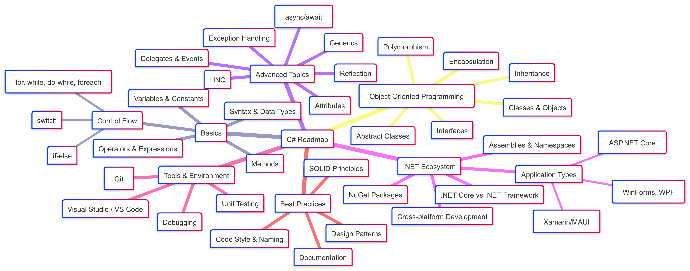

# 🎯 C# Programming Course Repository

Welcome to the **C# Course Repository** — a structured and hands-on path to mastering C# programming!

## 🧠 What is C#? 
**C#** is a modern, object-oriented, and type-safe programming language developed by **Microsoft**. It runs on the **.NET platform**, allowing you to build:

- Desktop Applications
- Web Applications
- Mobile Apps
- Games (Unity)
- APIs and Microservices
- Cloud-based Apps (Azure)

---

## 🧱 Key Features of C\#

| Feature                             | Description                                                                  |
| ----------------------------------- | ---------------------------------------------------------------------------- |
| 🔒 **Type Safety**                  | Detects type errors at compile time                                          |
| 🎯 **Object-Oriented**              | Supports OOP principles like classes, inheritance, polymorphism              |
| ⚙️ **Rich Libraries**               | The .NET library provides tools for everything from file I/O to XML handling |
| 🧪 **Automatic Garbage Collection** | No need to manually free memory                                              |
| ⚡ **Fast and Scalable**             | Great for enterprise applications                                            |
| 🧵 **Multithreading Support**       | Efficient background task handling                                           |
| ☁️ **Cross-Platform (.NET Core)**   | Build apps for Windows, Linux, macOS                                         |

---

## 🔧 What You Can Build with C\#

| Area         | Example                      | Tools/Frameworks |
| ------------ | ---------------------------- | ---------------- |
| Desktop Apps | Calculator, Inventory System | WinForms, WPF    |
| Web Apps     | Blogs, E-commerce Sites      | ASP.NET Core     |
| Mobile Apps  | Android/iOS Apps             | Xamarin, MAUI    |
| Games        | 2D/3D Games                  | Unity Engine     |
| APIs         | Web APIs                     | ASP.NET Web API  |
| Cloud Apps   | Azure Functions, WebJobs     | Azure + .NET     |

---

## 🔤 Basic C# Syntax (Quick Example)

```csharp
using System;

class Program
{
    static void Main()
    {
        Console.WriteLine("Hello, C# World!");
    }
}
```

---

## 🛣️ C# Learning Roadmap (Beginner to Advanced)

### 🟢 Beginner

* What is C#, .NET, CLR
* Variables and Data Types
* Input/Output (Console.ReadLine)
* Operators and Expressions
* Conditional Statements (`if`, `switch`)
* Loops (`for`, `while`, `do-while`)
* Arrays and Strings
* Functions / Methods

### 🟡 Intermediate

* Object-Oriented Programming:

  * Classes & Objects
  * Inheritance
  * Polymorphism
  * Abstraction & Interfaces
* Collections (`List`, `Dictionary`, `Queue`)
* File I/O (`StreamReader`, `StreamWriter`)
* Exception Handling
* Enums & Structs

### 🔴 Advanced

* LINQ (Language Integrated Query)
* Delegates and Events
* Async / Await
* Lambda Expressions
* Reflection & Attributes
* Dependency Injection
* Unit Testing (NUnit, xUnit)
* Working with Databases (Entity Framework Core)
* REST APIs with ASP.NET Core

---

## 🛠️ Tools for C# Development

| Tool               | Purpose                           |
| ------------------ | --------------------------------- |
| Visual Studio      | Full-featured IDE                 |
| Visual Studio Code | Lightweight editor with C# plugin |
| .NET SDK           | Required to run and build C# apps |
| Unity              | Game development                  |
| Postman            | API testing for ASP.NET apps      |

---

## 🧰 Popular Libraries & Frameworks

* **Entity Framework Core** – ORM for database access
* **ASP.NET Core** – Web development
* **Xunit / NUnit** – Testing
* **SignalR** – Real-time apps (chat, live dashboards)
* **Dapper** – Lightweight ORM

---

## 📦 Deployment Options

| Platform             | Method                          |
| -------------------- | ------------------------------- |
| Windows              | .exe installer, MSIX, ClickOnce |
| Web (cross-platform) | Docker, Azure, IIS, Nginx       |
| Android/iOS          | Xamarin, .NET MAUI              |
| Game Engines         | Unity                           |

---

## 📚 Resources to Learn C\#

* [Microsoft C# Docs](https://learn.microsoft.com/en-us/dotnet/csharp/)
* [Dotnet Official Site](https://dotnet.microsoft.com/)
* [w3schools C# Tutorial](https://www.w3schools.com/cs/)
* [C# on GeeksforGeeks](https://www.geeksforgeeks.org/csharp-programming-language/)
* [FreeCodeCamp - C# for Beginners](https://www.youtube.com/watch?v=GhQdlIFylQ8)

---

## 🎓 Final Tips

* Start with **console apps** to learn logic.
* Move to **WinForms/WPF** for GUI-based projects.
* Learn **ASP.NET Core** if you want to go into web development.
* Use **Unity** if you're interested in game dev.
* Push your code to **GitHub** to build a portfolio.


---

## ✅ Roadmap of C Sharp



